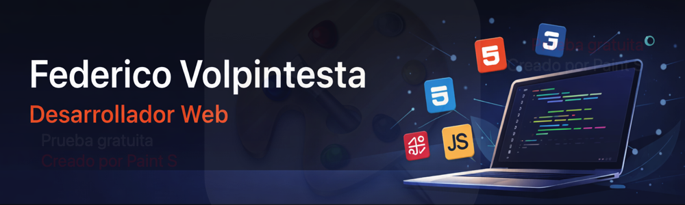

  

<h1 align="center">👋 Hola, soy Federico Volpintesta</h1>

<h3 align="center">💻 Desarrollador Front-End en formación</h3> 

  
  
  

💻 Desarrollo web | 🎨 Maquetado | 🏨 Background en hotelería  
 
📍 Santa Fe, Argentina

 

🧑‍💻 Sobre mí

  Actualmente me estoy formando en desarrollo web, enfocándome en crear
interfaces claras, funcionales y prolijas, aplicando buenas prácticas
de HTML, CSS y JavaScript.

---

🛠️ Tecnologías que utilizo

  

---

📌 Proyectos destacados

### 🏨 Hotel Andina
Sitio web institucional para hotel, enfocado en diseño limpio y responsive.  
🔗[https://federicovolpintesta-eng.github.io/proyecto-hotel-andina-html/]

  

---

# 🏨 Lost & Found - Gestión de Hallazgos (Los Pinos Resort)

  

Sistema integral desarrollado para digitalizar y optimizar el proceso de objetos perdidos y hallados en hotelería. Reemplaza planillas manuales por un ecosistema digital con persistencia de datos y automatización de documentos legales.

* **📺 Demo en Video:** [Ver funcionamiento del sistema](https://github.com/federicovolpintesta-eng/lostfound-hotel/blob/main/vdemolostfound.mov)

### 🛠️ Key Features:
* **Dashboard de Control:** KPIs de eficacia de devolución y objetos críticos con Chart.js.
* **Automatización Legal:** Generación de Actas de Entrega en PDF con jsPDF.
* **Backend:** Persistencia y Auth mediante Supabase (PostgreSQL).
* **Filtros Avanzados:** Gestión de inventario y sección especial para Donaciones.

---

📫 Contacto

- 📧 Email: federicovolpintesta@gmail.com  
- 💼 LinkedIn: https://www.linkedin.com/in/federico-volpintesta-675378248/

Siempre abierto a aprender, mejorar y sumar experiencia 🚀

